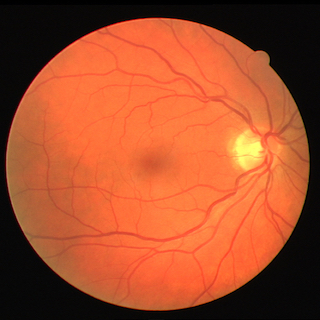
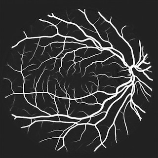
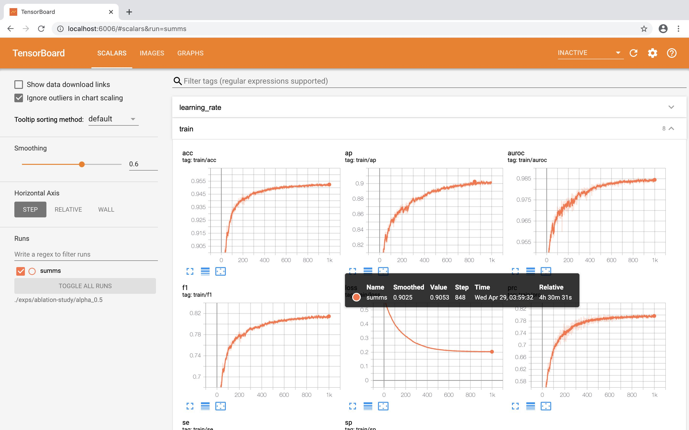
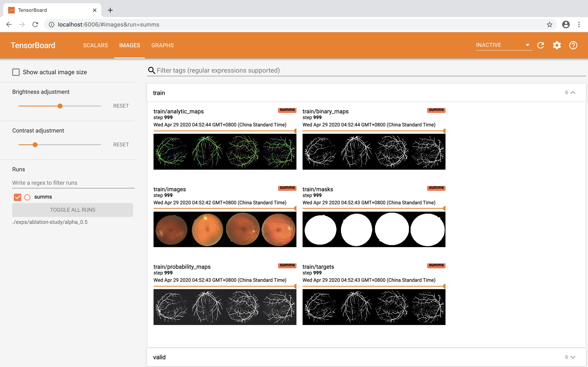

# Octave UNet for Retinal Vessel Segmentation

This is an implementation of [Octave UNet](https://arxiv.org/abs/1906.12193) with PyTorch. The model generates segmentation for retinal vascular structures in color fundus images. It is based on the backbone of the UNet model and integrated with the octave convolution and the octave transposed convolution operations.



This repository contains:

* Implementation of Octave UNet models and UNet models (`src/models/octave/octave_unet.py`).
* Training code for retinal vessel segmentation datasets including: [DRIVE](http://www.isi.uu.nl/Research/Databases/DRIVE/), [CHASEDB1](https://blogs.kingston.ac.uk/retinal/chasedb1/), [STARE](http://cecas.clemson.edu/~ahoover/stare/), and [HRF](https://www5.cs.fau.de/research/data/fundus-images/).
* Evaluation metrics (`src/metrics/*.py`) for binary segmentation including: accuracy, sensitivity, specificity, f1-score, AUROC, and AP.
* Jupyter notebooks (`notes/*.ipynb`) for demonstrating usages and visualizing the segmentation performances reported in the paper.

## Citation

If you find this repository useful in your research, please consider citing our paper with the following Bibtex:

```bibtex
@misc{fan2019octave,
    title={Accurate Retinal Vessel Segmentation via Octave Convolution Neural Network},
    author={Zhun Fan and Jiajie Mo and Benzhang Qiu and Wenji Li and Guijie Zhu and Chong Li and Jianye Hu and Yibiao Rong and Xinjian Chen},
    year={2020},
    eprint={1906.12193},
    archivePrefix={arXiv},
    primaryClass={eess.IV}
}
```

## Getting Started

### TL;DR

```Shell
python main.py --configs=*.yaml
```

### Requirements

* Python 3.7,
* PyTorch 1.4,
* and other packages listed in `environment.yaml`.

### Prepare Datasets

[notes/retinal-vessel-segmentation-datasets.ipynb](notes/retinal-vessel-segmentation-datasets.ipynb): This notebooks demonstrates the usage of dataset class implemented for the following retinal vessel segmentation datasets: [DRIVE](http://www.isi.uu.nl/Research/Databases/DRIVE/), [CHASEDB1](https://blogs.kingston.ac.uk/retinal/chasedb1/), [STARE](http://cecas.clemson.edu/~ahoover/stare/), and [HRF](https://www5.cs.fau.de/research/data/fundus-images/).

These implementation of dataset classes in `src/datasets/*` should be able to handle the download and extraction of the compressed source files.
However, if the auto-download processes failed, you can download the dataset source files from their official websites manually and organize the source files in the following directory structure:

```ascii
data
├── CHASEDB1
│   └── CHASEDB1.zip
├── DRIVE
│   └── DRIVE.zip
├── HRF
│   ├── all_data
│   |   └── all.zip
│   ├── diabetic_data
│   |   ├── diabetic_retinopathy_fovmask.zip
│   |   ├── diabetic_retinopathy_manualsegm.zip
│   |   └── diabetic_retinopathy.zip
│   ├── glaucoma_data
│   |   ├── glaucoma_fovmask.zip
│   |   ├── glaucoma_manualsegm.zip
│   |   └── glaucoma.zip
│   ├── healthy_data
│   |   ├── healthy_fovmask.zip
│   |   ├── healthy_manualsegm.zip
│   |   └── healthy.zip
│   └── optic_disk_centers.xls
└── STARE
    ├── label-ah.tar
    ├── label-vk.tar
    └-─ stare-images.tar
```

These dataset classes can also handle the pre-processing and augmentation pipeline, please refer to `src/processings/preprocessings.py` and `src/processings/augmentations.py` for more details.

### Training and Testing Neural Network for Retinal Vessel Segmentation

This implementation adopts [YACS](https://github.com/rbgirshick/yacs) for parsing `.yaml` files that containing configuration settings for experiments.
You can find two configuration templates at `exps/ablation-study/alpha_0.0/run_time_configs.yaml` and `exps/ablation-study/alpha_0.5/run_time_configs.yaml`, which contain the experiment settings of the UNet and the Octave UNet on DRIVE dataset, respectively.

Simply run the following command to start the training process of the Octave UNet model:

```Shell
python main.py --configs=exps/ablation-study/alpha_0.5/run_time_configs.yaml
```

The training process will generate the following outputs:

```ascii
exps/ablation-study/alpha_0.5
├── ckpts
|   ├── last.pth
│   └── ...
├── logs
|   ├── debug.log
│   └── info.log
├── summs
│   └── ...
├── ...
├── model_summary.csv
└── run_time_configs.yaml
```

The `ckpts` folder contains the saved checkpoint files for the model.

The `logs` folder contains the different logging levels of recored console outputs.

The `summs` folder contains the [Tensorboard](https://www.tensorflow.org/tensorboard) summary files, which can be used for monitoring the training process.

```Shell
tensorboard --logdir=exps/ablation-study/alpha_0.5
```




The `model_summary.csv` is a summary of model architecture and layer-wise computation expenditure. The model architecture can also be visualized by Tensorboard within the Graph tab.

The `run_time_configs.yaml` is a backup file of the configurations of the current experiment.

By default, upon the finish/interruption of training process, a testing process will be executed if a test set is provided in configuration. The testing process will generates the following outputs:

```ascii
exps/ablation-study/alpha_0.5
├── outs
|   ├── last
|   |   ├── id-analytic_maps.png
|   |   ├── id-binary_maps.png
|   |   ├── id-probability_maps.png
|   |   ├── ...
|   |   └── performances.csv
│   └── ...
└── ...
```

The `outs` folders contains the outputs of each monitor. By default, the finial results are always logged in the `outs/last` folder, which contains image results including: `id-binary_maps.png`, `id-probability_maps.png`, and `id-analytic_maps.png` for the `id`-th sample. The `performances.csv` contains the evaluation values of each sample in the test set.

### Parsing Experimental Results

[notes/ablation-study.ipynb](notes/ablation-study.ipynb): This notebook demonstrates how to parse the outputted experimental results from the testing procedure and illustrates the difference between UNet and Octave UNets as reported in the Section VI-C of the paper.

[notes/performances-on-datasets.ipynb](notes/performances-on-datasets.ipynb): This notebook presents the numerical experimental results on datasets as reported in the Section VI-D of the paper.
